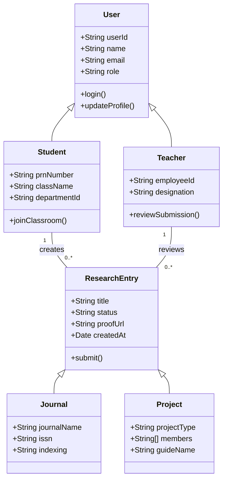
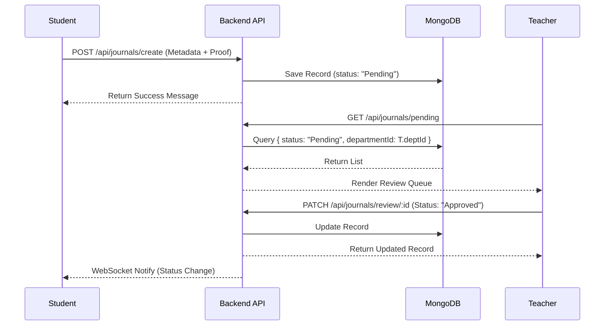
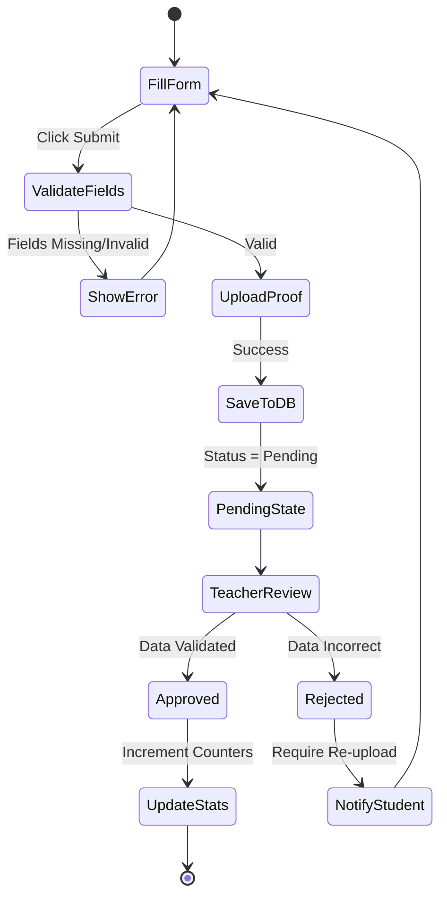
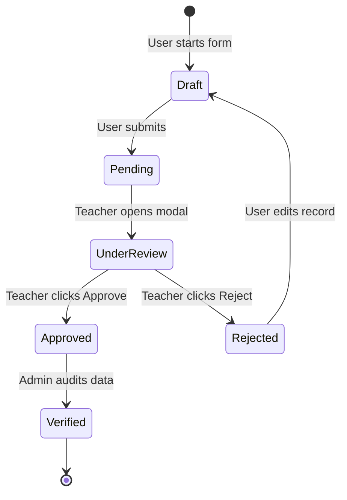
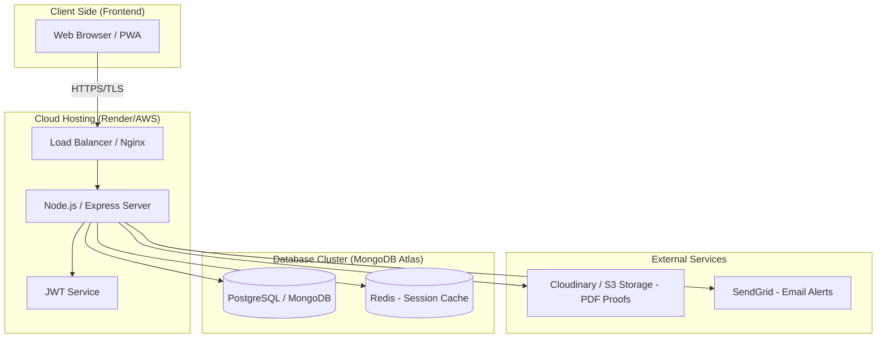

# UML Diagrams Code: DeptSync Project
This file contains the **Mermaid.js** source code for all UML diagrams associated with the DeptSync Department Management system.

### How to Generate Diagrams:
1.  **Mermaid Live Editor**: Copy the code below and paste it into [Mermaid.live](https://mermaid.live/).
2.  **VS Code**: Install the "Mermaid Preview" extension to see these diagrams directly in your editor.
3.  **GitHub**: These code blocks will automatically render as diagrams when pushed to a GitHub repository in a `.md` file.

---

### 4.1 Use Case Diagram
**Purpose**: Illustrates the functional requirements and the actors (Student, Teacher, Admin) interacting with the system.

```mermaid
useCaseDiagram
    actor "Student" as S
    actor "Teacher (Coordinator)" as T
    actor "Admin" as A

    package "DeptSync Core System" {
        usecase "Join Classroom" as UC1
        usecase "Submit Research (Journal/Patent)" as UC2
        usecase "View Personal Stats" as UC3
        usecase "Review Submission Queue" as UC4
        usecase "Approve/Reject Research" as UC5
        usecase "Manage Department Users" as UC6
        usecase "Generate NAAC/NIRF Analytics" as UC7
    }

    S --> UC1
    S --> UC2
    S --> UC3

    T --> UC4
    T --> UC5
    T --> UC1 : Manages

    A --> UC6
    A --> UC7
```

---

### 4.2 Class Diagram
**Purpose**: Shows the static structure of the system, including data models and their relationships.



---

### 4.3 Sequence Diagram
**Purpose**: Visualizes the step-by-step logic of the Research Approval process.



---

### 4.4 Activity Diagram
**Purpose**: Outlines the logical flow of a student submitting an academic contribution.



---

### 4.5 State Diagram
**Purpose**: Defines the lifecycle states of a research record from creation to approval.



---

### 4.6 Deployment Diagram
**Purpose**: Shows the physical architecture and deployment environment.


