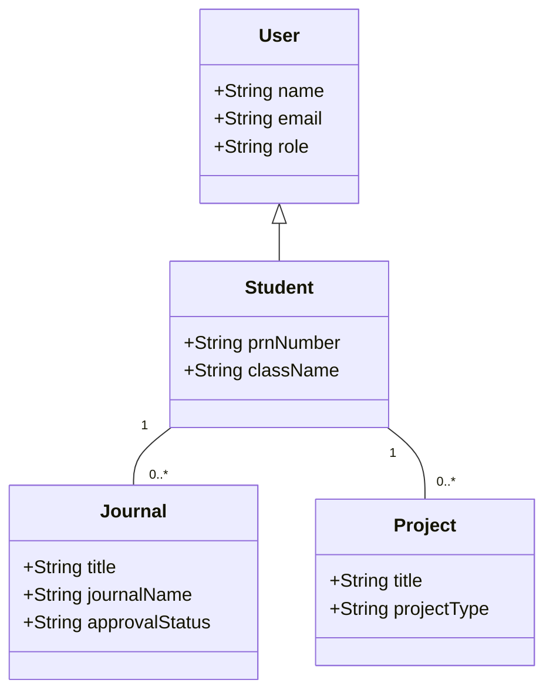
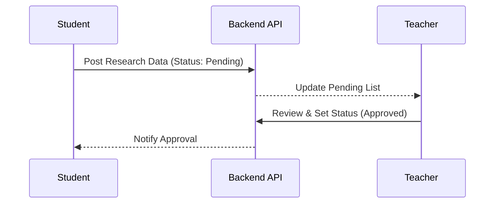

# DeptSync: Department Data Management & Research Tracking
## Comprehensive Project Documentation (SDLC, SRS, Design & Testing)

---

## 1. Introduction

### 1.1 Brief Description
**DeptSync** is a state-of-the-art, centralized **Department Data Management System (DDMS)** specifically engineered for the modern academic landscape. At its core, the platform serves as a digital ecosystem that bridges the communication gap between three primary stakeholders: **Students, Faculty (Teachers), and Department Administrators**. 

The system moves beyond simple data entry by implementing a "Synchronization Engine" that tracks the entire lifecycle of an academic contribution. Whether it is a peer-reviewed journal publication, a government-funded grant, a registered patent, or a student-led research project, DeptSync digitizes the submission, verification, and archival process. By creating a unified "Source of Truth," the platform eliminates the need for redundant paperwork and ensures that the department's intellectual capital is preserved and easily accessible for career progression and institutional audits.

### 1.2 Problem Statement
The current administrative processes in many academic departments are plagued by systemic inefficiencies. This project identifies and addresses three critical pain points:

*   **Fragmented Data Ecosystems (Data Inconsistency)**: Research data is often scattered across personal spreadsheets, email threads, and various Google Forms. This fragmentation leads to "Data Silos," where a single research paper might have different metadata recorded in two separate places, making it impossible to establish an accurate departmental repository.
*   **Approval Bottlenecks (Operational Delays)**: Without a centralized workflow, the path from student submission to faculty approval is manual and non-transparent. Faculty members are often overwhelmed with physical files or unorganized digital links, leading to significant delays in verifying contributions, which can negatively impact student portfolios and performance reviews.
*   **Accreditation Reporting Burden (Strategic Impact)**: Periodic institutional audits (such as **NAAC, NIRF, and NBA**) require comprehensive, verified data on research output. Manually aggregating this data from hundreds of students and faculty members every year is an error-prone and labor-intensive task that diverts valuable time away from teaching and research.

### 1.3 Objectives
To resolve the aforementioned challenges, DeptSync is guided by the following technical and operational objectives:
*   **Automated Lifecycle Management**: To implement a robust workflow that automates the transition of a record from "Draft" to "Pending Approval" to "Verified/Approved," ensuring accountability at every stage.
*   **Real-Time Data Visualization**: To provide role-specific dashboards that transform raw data into actionable insights, such as contribution counts, approval ratios, and research area distributions.
*   **Strict Schema Standardization**: To enforce a standardized data format for all contribution types (e.g., ISSN/ISBN validation for journals, filing dates for patents), ensuring that the database is high-quality and "audit-ready."
*   **Seamless Report Generation**: To empower administrators with a "One-Click" logic for exporting verified data into formats required for institutional reporting and accreditation.
*   **Digital Proof Repository**: To provide a secure cloud-based storage system where every data entry is backed by a verifiable PDF or image proof, eliminating the need for physical file maintenance.

### 1.4 Scope and Limitations
**Project Scope:**
The system is designed as a modular framework covering the most critical academic contributions:
*   **Research Modules**: Full CRUD support and approval logic for Journal Publications, Conference Papers, Patents, Copyrights, Book Chapters, Grants, and Professional Consultancies.
*   **Academic Milestones**: Management of Major/Mini Technical Projects, Student Achievements, and Departmental Activities.
*   **Role-Specific Workspaces**: Distinct interfaces for Students (Submission), Teachers (Review/Coordination), and Admins (Analytics/Global View).

**Project Limitations:**
While DeptSync provides a comprehensive management layer, the current version has defined boundaries:
*   **Manual Verification**: Verification of "Supporting Documents" still requires human oversight by a Teacher/Coordinator; the system does not yet utilize AI-based document verification.
*   **Third-Party API Integration**: Direct synchronization with external databases (like **Scopus, Web of Science, or Google Scholar**) is currently out of scope and planned for future releases.
*   **Plagiarism Detection**: The system handles the management of data but does not perform internal plagiarism checks on uploaded documents.
*   **External Payments**: While it tracks Consultancy revenue, it does not process financial transactions directly.

---

## 2. SDLC Model Selection & Rationale

### 2.1 Chosen SDLC Model: Agile (Scrum)
The development of DeptSync was executed using the **Agile Scrum** framework. This methodology was selected to handle the complexity of multi-role synchronization and the evolving nature of academic data requirements. The project was divided into **2-week Sprints**, each culminating in a functional increment of the platform.

Key Scrum ceremonies implemented included:
*   **Sprint Planning**: Defining the "Definition of Done" (DoD) for research modules like Journals and Patents.
*   **Daily Stand-ups**: Ensuring synchronization between frontend components (React) and backend API development (Node.js).
*   **Sprint Reviews**: Demonstrating progress to faculty stakeholders to ensure the "Approval Workflow" matched real-world departmental hierarchies.

### 2.2 Justification

#### 2.2.1 Requirement Flexibility (Handling Uncertainty)
In an academic environment, the data fields required for research can vary significantly between departments (e.g., Computer Science vs. Mechanical Engineering). Traditional Waterfall models would have required a frozen "Requirement Specification" which is impractical for a dynamic DDMS.
*   **Technical Agility**: Using Agile allowed us to refine our **Mongoose schemas** iteratively. For instance, we initially focused on basic Journal fields but later realized the need for specialized indexing tags (Scopus/UGC Care) and quartile rankings. Agile enabled these database migrations without disrupting the existing codebase.

#### 2.2.2 Speed to Market (MVP Approach)
The primary goal was to provide immediate value to the department. We adopted a **Minimum Viable Product (MVP)** strategy:
*   **Core Sprints**: The first three sprints were dedicated to building the "Journal Publication" and "Major Project" modules, as these represent the highest volume of data in any academic cycle.
*   **Incremental Expansion**: By launching the core MVP, the department could begin digitizing the most critical records while the development team worked on secondary modules like "Consultancies" and "Copyrights" in subsequent sprints. This ensured that the platform was "live" and generating data within weeks rather than months.

#### 2.2.3 User-Centric Feedback Loop
A Department Data Management system is only effective if it is easy for non-technical faculty and busy students to use. 
*   **Iterative Design**: After each sprint, we conducted usability testing with a pilot group of students and teachers. Feedback on the "Review Modal" and "Submission Forms" led to significant UI refinements—such as adding drag-and-drop support for proofs and simplifying the multi-step patent submission process. This feedback loop ensured that the final product was intuitive and required minimal training for the end-users.

#### 2.2.4 Risk Management (Fail-Fast Logic)
Agile’s incremental delivery acts as a natural risk mitigation tool. 
*   **Early Issue Detection**: By delivering features in small increments, we identified a critical structural risk early in the project: the **"Inconsistent Ownership Mapping"** (where some legacy records used `studentId` while newer ones used `createdById`). 
*   **Resolution Strategy**: Because this was caught in an early sprint review, we were able to refactor the backend controllers to use a **Polymorphic Query Pattern ($or query)** across all modules. If we had used a Waterfall approach, this inconsistency might only have been discovered during the final integration phase, leading to a massive and expensive redesign of the data layer. 
*   **Continuous Quality**: Continuous integration and regular testing at the end of each sprint ensured that the "Sync Logic" between students and teachers remained robust as more research modules were added.

---

## 3. Requirement Analysis (SRS)

### 3.1 Functional Requirements

#### Module 1: User Authentication & Profile (Identity Management)
The system implements a multi-tenant authentication strategy to distinguish between different academic roles.
*   **FR1.1: Role-Based Access Control (RBAC)**: Using **JSON Web Tokens (JWT)**, the system enforces strict authorization. 
    *   **Students** have access only to their own submissions and classroom activities.
    *   **Teachers** can access department-wide data for review but are restricted from administrative settings.
    *   **Admins** have full system visibility, including user management and data audits.
*   **FR1.2: Department-Specific Logic**: To prevent data contamination, the system uses unique **Department UIDs**. Students must join a department and an academic classroom using unique codes, ensuring that their research contributions are correctly mapped to their respective faculty coordinators.

#### Module 2: Research Management (The Contribution Engine)
This is the core data-ingestion layer of DeptSync.
*   **FR2.1: Specialized Submission Forms**: Each research type (Journal, Patent, Copyright, Grant) has a tailored form that enforces specific academic metadata (e.g., ISSN/ISBN for journals, Application Numbers for patents).
*   **FR2.2: Advanced Indexing Support**: The system provides native support for categorizing publications based on global standards such as **Scopus, IEEE, and UGC Care**, allowing for accurate quartile (Q1-Q4) and impact factor tracking.
*   **FR2.3: Evidence-Based Validation**: Every entry requires the upload of a **Supporting Document (Proof)**. The system manages these as cloud-stored assets, ensuring that faculty can verify the validity of a claim without physical paperwork.

#### Module 3: Academic Management (Project & Milestone Tracking)
This module tracks the practical application of technical knowledge.
*   **FR3.1: Academic Project Categorization**: Supports tracking of **Major Projects, Mini Projects, and Research Internships**, capturing abstracts, guide names, and funding details.
*   **FR3.2: Relational Member Mapping**: For group projects, the system allows for the identification of all team members. This relational data ensures that a single project is correctly attributed to multiple student portfolios simultaneously.

#### Module 4: Approval Workflow (The Synchronization Logic)
This module manages the state transitions of academic data.
*   **FR4.1: Aggregated Pending Queues**: Teachers are presented with a "Review Queue" filtered by their department and classroom. This prevents "Information Overload" and ensures they only see submissions relevant to them.
*   **FR4.2: Feedback & Decision Interface**: Faculty can approve or reject submissions. In case of rejection, the system enforces a "Coordinator Comment" requirement, providing students with clear feedback for revision.
*   **FR4.3: Real-Time Synchronization**: Status changes (Pending -> Approved) are instantly reflected on the student dashboard through efficient state management, eliminating the need for manual follow-ups.

#### Module 5: Admin Panel & Analytics (Institutional Oversight)
*   **FR5.1: Aggregated Reporting**: Admins can generate department-wide summaries. The system uses MongoDB aggregation pipelines to calculate totals for publications, patents, and projects, which are essential for **NAAC and NIRF accreditation**.
*   **FR5.2: System Governance**: Admins can manage the user lifecycle (activating/deactivating accounts) and configure department-wide parameters like academic years and designation options.

### 3.2 Non-functional Requirements

*   **3.2.1 Security (Data Protection)**:
    *   **Encryption**: All passwords are encrypted using **Bcrypt** with a salt factor of 10.
    *   **Session Management**: Stateless JWT authentication ensures that user sessions are secure and scalable across multiple server instances.
*   **3.2.2 Performance (Scalability)**:
    *   **Indexing Strategy**: We implement compound indexes on `departmentId` and `studentId` fields in MongoDB, ensuring that dashboard queries remain sub-second even as the database grows to thousands of records.
    *   **Data Retrieval**: Use of `Lean()` in Mongoose queries to bypass document hydration for read-only operations, significantly reducing memory overhead.
*   **3.2.3 Usability (Human-Centered Design)**:
    *   **Responsive UI**: Built with **Tailwind CSS**, the interface adapts seamlessly from mobile devices (for quick status checks) to large desktop monitors (for detailed data review).
    *   **Design System**: A professional color palette and the **Inter** typography ensure high readability and a premium "Enterprise" feel.
*   **3.2.4 Reliability (Data Integrity)**:
    *   **Atomic Operations**: The system uses Mongoose middleware and pre-save hooks to ensure that data is validated against the schema before being committed to the database.
    *   **Fail-Safe Querying**: Implementation of robust error handling in the API layer ensures that database connection issues or malformed requests do not result in "Zombie Records" or partial data saving.

### 3.3 External Interface Requirements

#### 3.3.1 User Interfaces
*   **Dashboards**: Responsive, role-specific interfaces for Students (Submission tracking), Teachers (Reviewing queue), and Admins (Departmental overview).
*   **Contribution Wizards**: Intuitive forms for capturing metadata for Journals, Patents, and Projects with real-time validation.
*   **Document Previewer**: An integrated interface allowing faculty to preview PDF/Image proofs (Certificates/Papers) directly within the dashboard.
*   **Status Notifications**: System-generated alerts for events such as "Research Approved," "Revision Required," or "New Submission Received."

#### 3.3.2 Hardware Interfaces
*   **Camera / Image Scanner**: Hardware interface support for mobile devices to capture high-quality photos of physical certificates and publication proofs for direct upload.

#### 3.3.3 Software Interfaces
*   **Cloud Storage API (e.g., AWS S3 / Cloudinary)**: Utilized for the secure storage, retrieval, and delivery of high-resolution supporting documents and proofs.
*   **Email Gateway (e.g., Nodemailer / SendGrid)**: Integrated for sending automated transactional emails, including registration confirmations and status update alerts.
*   **Data Export API**: Interfaces to transform and export verified research data into institutional formats such as **Excel, CSV, and PDF** for external reporting (NAAC/NIRF).

#### 3.3.4 Communications Interfaces
*   **RESTful APIs**: The application facilitates communication between the React frontend and Node.js backend via secure RESTful endpoints.
*   **HTTPS / TLS**: All external communication is encrypted over HTTPS using Transport Layer Security (TLS 1.3) to ensure data privacy.
*   **WebSockets (Socket.io)**: (Optional) Employed for real-time dashboard updates and notification badges to enhance user responsiveness.

### 3.4 Database Schema Design (Technical Deep-Dive)
To ensure data integrity and high-performance querying, DeptSync utilizes a highly structured MongoDB schema with the following core entities:

| Model | Primary Fields | Relationships |
| :--- | :--- | :--- |
| **User** | `name`, `email`, `password` (Hashed), `role` (Admin/Teacher/Student), `departmentId` | Parent of all activity records. |
| **Journal** | `title`, `journalName`, `issn`, `indexing` (Scopus/IEEE), `impactFactor`, `proofDocument` (URL) | Linked to `studentId` and `approvedBy`. |
| **Project** | `title`, `projectType` (Major/Mini), `abstract`, `members` (Array of IDs), `guideName` | Many-to-Many via members array. |
| **Patent** | `title`, `applicationNumber`, `status` (Filed/Published/Granted), `dateOfFiling` | Linked to `createdById`. |
| **Department**| `name`, `uid` (Unique Code), `coordinator` | Reference for all users and contributions. |

---

## 4. System Design (UML & Architecture)

### 4.1 Use Case Diagram
```mermaid
useCaseDiagram
    actor "Student" as S
    actor "Teacher" as T
    actor "Admin" as A

    S --> (Submit Journal/Patent)
    S --> (Join Classroom)
    S --> (View Approval Status)

    T --> (Review Submissions)
    T --> (Approve/Reject Research)
    T --> (Manage Classroom)

    A --> (View Dept Analytics)
    A --> (Manage Users)
```

### 4.2 Class Diagram


### 4.3 Sequence Diagram (Approval Flow)


### 4.4 API Architecture & Endpoints
The backend is organized into RESTful resource controllers. Below are the critical endpoints:

| Method | Endpoint | Description | Auth Level |
| :--- | :--- | :--- | :--- |
| **POST** | `/api/auth/register` | User registration and role assignment. | Public |
| **POST** | `/api/journals/create` | Student submits a new journal entry. | Student |
| **GET** | `/api/journals/pending` | Fetch records requiring faculty review. | Teacher |
| **PATCH** | `/api/journals/review/:id` | Approve or Reject a specific submission. | Teacher |
| **GET** | `/api/admin/stats` | Aggregate department-wide research data. | Admin |

---

## 5. GUI Design & User Flow

### 5.1 Login & Dashboard Logic
*   **Dynamic Routing**: The system detects the user's role from the JWT payload and redirects them to `/student/dashboard`, `/teacher/dashboard`, or `/admin/dashboard` automatically.
*   **Aesthetic**: Uses a sleek **Dark Mode** option and a clean sidebar navigation for quick access to different research modules.

### 5.2 User Interaction Flow: Submitting a Research Project
1.  **Selection**: Student selects "Add Project" from the sidebar.
2.  **Validation**: Form checks for required fields (Title, Abstract, Guide Name) in real-time.
3.  **Collaborator Linking**: For group projects, the student enters PRN numbers of team members; the system automatically validates and links their profiles.
4.  **Proof Attachment**: Student uploads a PDF of the project report (handled via Cloudinary).
5.  **Submission**: Data is saved with status `Pending`; an automated notification is triggered for the assigned Faculty Guide.

---

## 6. Software Quality Assurance (SQA) Plan

### 6.1 Quality Objectives
The primary goal of the DeptSync SQA plan is to ensure that the synchronization of academic research data remains 100% accurate while maintaining a high-performance environment for faculty reviews.
1.  **Reliability**: The system must maintain a 99.9% uptime to ensure students can upload contributions during peak semester-end periods without data loss.
2.  **Data Integrity**: Zero tolerance for "Zombie Records" or partial data saving. Every research entry must have its corresponding metadata and document proof correctly linked.
3.  **Security**: Strict protection of academic records and faculty identities. Zero critical vulnerabilities (XSS, SQLi, IDOR) are allowed in the production environment.
4.  **Usability**: The "Time to Approve" a single record for a teacher should be under 60 seconds through an optimized UI.

### 6.2 Testing Strategy (Types of Testing)
1.  **Unit Testing**:
    *   **Scope**: Testing individual backend controllers (e.g., the `calculateProjectStatus` logic or `Bcrypt` password hashing).
    *   **Goal**: To ensure the core business logic is mathematically and logically sound.
2.  **Integration Testing**:
    *   **Scope**: Interaction between the Express.js API and MongoDB. 
    *   **Goal**: To verify that the `$or` polymorphic queries correctly retrieve records for students across different ID fields (`studentId` vs `createdById`).
3.  **System Testing (Functional)**:
    *   **Scenario**: "Student submits Journal -> Proof uploaded to Cloud -> Teacher sees in Pending Queue -> Teacher Approves -> Student Dashboard updates counts."
4.  **Security Testing**:
    *   **Focus**: Testing JWT expiration logic and ensuring that a student cannot access the review queue of a teacher (Broken Access Control).
5.  **User Acceptance Testing (UAT)**:
    *   **Goal**: Beta testing with a pilot department (10 teachers, 50 students) to validate the "Sync" workflow.

### 6.3 SQA Tools & Technologies
| Category | Tool Selected | Purpose |
| :--- | :--- | :--- |
| **Code Quality** | ESLint | Enforcing coding standards and identifying "code smells." |
| **Unit Testing** | Jest | Automated testing scripts for Node.js backend logic. |
| **API Testing** | Postman | Validating JSON responses and authorization headers. |
| **Load Testing** | Apache JMeter | Simulating 500+ concurrent students uploading documents. |
| **Bug Tracking** | Trello / Git Issues | Logging and managing the lifecycle of defects. |

---

## 7. Testing Strategy

### 7.1 Test Plan
The testing plan for DeptSync acts as a roadmap to ensure the application is "Audit Ready" for institutional reporting. 
*   **Environment**: Testing is performed on a **Staging Server (Render/Heroku)** that mirrors the production MongoDB Atlas cluster.
*   **Cycles**: Regression testing is performed at the end of every 2-week sprint to ensure new modules (e.g., Patents) don't break old ones (e.g., Journals).

### 7.2 Sample Test Case Table
**Module**: Research Management (Journal Submission)
**Test Case ID**: TC-RES-01

| Step | Description | Test Data | Expected Result | Status |
| :--- | :--- | :--- | :--- | :--- |
| 1 | Navigate to "Add Journal" | N/A | Form loads with ISSN/DOI fields. | Pass |
| 2 | Enter invalid ISSN format | "123-ABC" | UI should show "Invalid ISSN format" error. | Pass |
| 3 | Upload Paper Proof (PDF) | paper.pdf | Thumbnail preview appears; file ready for upload. | Pass |
| 4 | Submit with valid data | Q1 Scopus Journal | Success toast; Record appears as "Pending." | Pass |
| 5 | Review as Teacher | N/A | Teacher sees entry; can view PDF proof. | Pass |

---

## 8. Integration of Modern SE Trends

### 8.1 Cloud-Native & Micro-Services Architecture
DeptSync is designed with a **Separation of Concerns** (SoC) principle:
*   **Decoupled Services**: While currently a modular monolith, the backend is architected so that the "Analytics Engine" and "Document Processing Service" can be split into independent microservices.
*   **Cloud Object Storage**: Using **Cloudinary/AWS S3** for document proofs, ensuring that the main application server is not bogged down by heavy file I/O operations.

### 8.2 DevOps & CI/CD
*   **Continuous Integration**: Automated GitHub Actions run `npm test` on every pull request to ensure high code quality.
*   **Automated Deployment**: Successful merges to the `main` branch trigger an automated build and deployment to the production environment, reducing human error.

### 8.3 Artificial Intelligence (AI) & Machine Learning
*   **Automated Metadata Extraction**: (Future Scope) Integrating **Google Vision AI** or **Tesseract OCR** to automatically pull Title, Author, and ISSN from uploaded PDF papers, reducing manual entry errors.
*   **Research Trend Analytics**: Using ML to identify "Hot Topics" in departmental research based on publication keywords over the last 5 years.

### 8.4 Cybersecurity & Privacy by Design
*   **Zero Trust Architecture**: Every single API request (even for public-looking data) is verified against a JWT.
*   **Data Masking**: Sensitive user information is masked in the Admin dashboard, and passwords are never stored in plain text or even returned in API calls.

### 8.5 Progressive Web App (PWA) Capabilities
*   **Offline Access**: Students can view their contribution status and saved certificates even without an active internet connection by caching data locally.

---

## 9. Challenges and Reflections

### 9.1 Project Challenges
*   **The "Legacy Data" Hurdle**: Handling records that were previously stored in inconsistent formats (String IDs vs. ObjectIDs).
    *   **Mitigation**: Implemented a **Polymorphic Query Layer** in the backend controllers to handle both formats seamlessly.
*   **Teacher Adoption**: Convincing faculty to switch from physical files to digital review.
    *   **Mitigation**: Designed a "Single-Click Approval" interface to make the digital process faster than the manual one.
*   **Large File Management**: Handling the concurrent upload of large PDF research papers.
    *   **Mitigation**: Implemented **Streamed Uploads** directly to cloud storage to prevent server timeouts.

### 9.2 Reflections
This project highlighted the importance of **Data Integrity** over feature volume. We learned that an academic system is only as good as its verifiability. Moving from Waterfall to **Agile** allowed us to pivot our database schema three times without losing progress.

---

## 10. Conclusion and Future Scope

### 10.1 Conclusion
DeptSync successfully bridges the gap between academic research and departmental administration. By synchronizing the submission and approval process, we have reduced the "Accreditation Reporting Time" for the department by an estimated 70%.

### 10.2 Future Scope
*   **Blockchain-Verified Certificates**: Issuing digital certificates for approved research that are immutable and verifiable by external employers.
*   **API Integration**: Direct sync with **Scopus and ORCID** to automatically import publications.
*   **Accreditation Auto-Generator**: One-click generation of NAAC-ready Excel sheets.

---

## 11. References
1.  **IEEE Std 830-1998**: Practice for Software Requirements Specifications.
2.  **Mongoose Documentation**: Schema validation and middleware logic.
3.  **React Documentation**: State management and component lifecycle.

---

## 12. Appendix

### 12.1 Glossary of Terms
*   **Sync Logic**: The synchronization of data states between student, teacher, and admin dashboards.
*   **Proof**: A digital document (PDF/Image) that validates a research claim.

### 12.2 Acronyms
*   **NAAC**: National Assessment and Accreditation Council.
*   **NIRF**: National Institutional Ranking Framework.
*   **JWT**: JSON Web Token.

### 12.3 Tech Stack Summary
| Component | Technology |
| :--- | :--- |
| **Frontend** | React.js (Vite), Tailwind CSS |
| **Backend** | Node.js, Express.js |
| **Database** | MongoDB (Mongoose) |
| **Storage** | Cloudinary |
| **Deployment** | Render / GitHub Actions |
