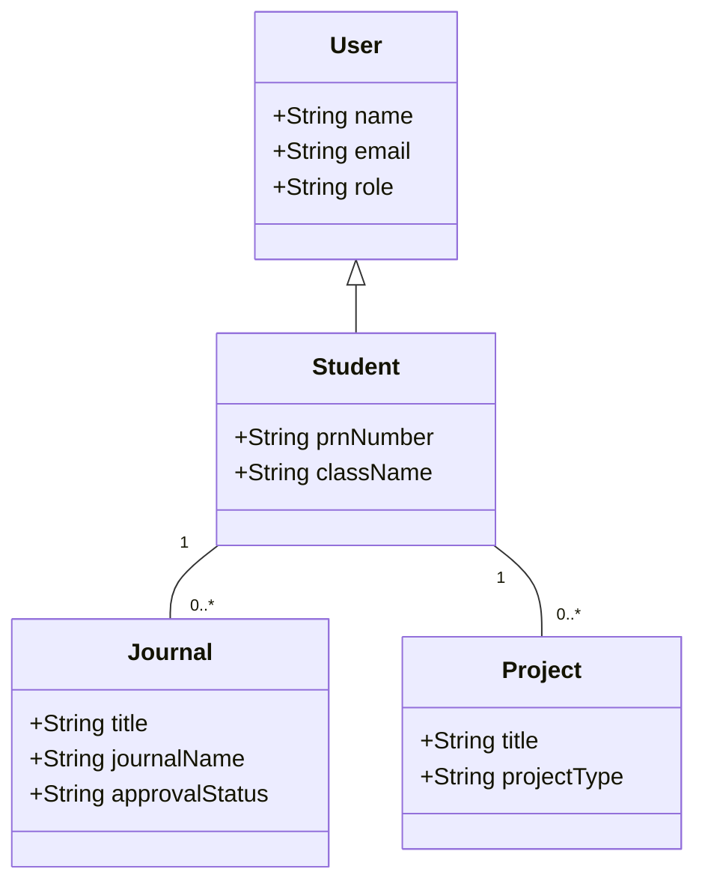
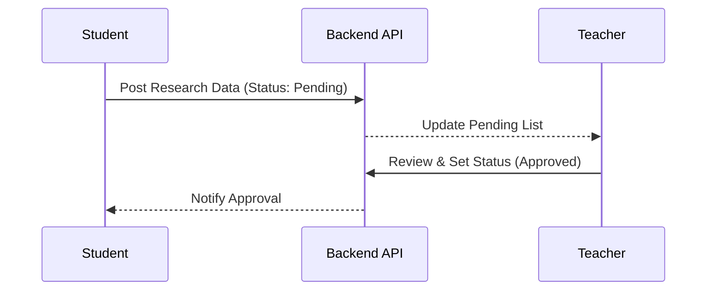

# DeptSync: Department Data Management & Research Tracking
## Comprehensive Project Documentation (SDLC, SRS, Design & Testing)

---

## 1. Introduction

### 1.1 Brief Description
**DeptSync** is a state-of-the-art, centralized **Department Data Management System (DDMS)** specifically engineered for the modern academic landscape. At its core, the platform serves as a digital ecosystem that bridges the communication gap between three primary stakeholders: **Students, Faculty (Teachers), and Department Administrators**. 

The system moves beyond simple data entry by implementing a "Synchronization Engine" that tracks the entire lifecycle of an academic contribution. Whether it is a peer-reviewed journal publication, a government-funded grant, a registered patent, or a student-led research project, DeptSync digitizes the submission, verification, and archival process. By creating a unified "Source of Truth," the platform eliminates the need for redundant paperwork and ensures that the department's intellectual capital is preserved and easily accessible for career progression and institutional audits.

### 1.2 Problem Statement
The current administrative processes in many academic departments are plagued by systemic inefficiencies. This project identifies and addresses three critical pain points:

*   **Fragmented Data Ecosystems (Data Inconsistency)**: Research data is often scattered across personal spreadsheets, email threads, and various Google Forms. This fragmentation leads to "Data Silos," where a single research paper might have different metadata recorded in two separate places, making it impossible to establish an accurate departmental repository.
*   **Approval Bottlenecks (Operational Delays)**: Without a centralized workflow, the path from student submission to faculty approval is manual and non-transparent. Faculty members are often overwhelmed with physical files or unorganized digital links, leading to significant delays in verifying contributions, which can negatively impact student portfolios and performance reviews.
*   **Accreditation Reporting Burden (Strategic Impact)**: Periodic institutional audits (such as **NAAC, NIRF, and NBA**) require comprehensive, verified data on research output. Manually aggregating this data from hundreds of students and faculty members every year is an error-prone and labor-intensive task that diverts valuable time away from teaching and research.

### 1.3 Objectives
To resolve the aforementioned challenges, DeptSync is guided by the following technical and operational objectives:
*   **Automated Lifecycle Management**: To implement a robust workflow that automates the transition of a record from "Draft" to "Pending Approval" to "Verified/Approved," ensuring accountability at every stage.
*   **Real-Time Data Visualization**: To provide role-specific dashboards that transform raw data into actionable insights, such as contribution counts, approval ratios, and research area distributions.
*   **Strict Schema Standardization**: To enforce a standardized data format for all contribution types (e.g., ISSN/ISBN validation for journals, filing dates for patents), ensuring that the database is high-quality and "audit-ready."
*   **Seamless Report Generation**: To empower administrators with a "One-Click" logic for exporting verified data into formats required for institutional reporting and accreditation.
*   **Digital Proof Repository**: To provide a secure cloud-based storage system where every data entry is backed by a verifiable PDF or image proof, eliminating the need for physical file maintenance.

### 1.4 Scope and Limitations
**Project Scope:**
The system is designed as a modular framework covering the most critical academic contributions:
*   **Research Modules**: Full CRUD support and approval logic for Journal Publications, Conference Papers, Patents, Copyrights, Book Chapters, Grants, and Professional Consultancies.
*   **Academic Milestones**: Management of Major/Mini Technical Projects, Student Achievements, and Departmental Activities.
*   **Role-Specific Workspaces**: Distinct interfaces for Students (Submission), Teachers (Review/Coordination), and Admins (Analytics/Global View).

**Project Limitations:**
While DeptSync provides a comprehensive management layer, the current version has defined boundaries:
*   **Manual Verification**: Verification of "Supporting Documents" still requires human oversight by a Teacher/Coordinator; the system does not yet utilize AI-based document verification.
*   **Third-Party API Integration**: Direct synchronization with external databases (like **Scopus, Web of Science, or Google Scholar**) is currently out of scope and planned for future releases.
*   **Plagiarism Detection**: The system handles the management of data but does not perform internal plagiarism checks on uploaded documents.
*   **External Payments**: While it tracks Consultancy revenue, it does not process financial transactions directly.

---

## 2. SDLC Model Selection & Rationale

### 2.1 Chosen SDLC Model: Agile (Scrum)
DeptSync utilizes the **Agile Scrum** framework.

### 2.2 Justification
#### 2.2.1 Requirement Flexibility
As the system is used by different departments, specific requirements for research fields often change. Agile allows us to refine our Mongoose schemas iteratively.
#### 2.2.2 Speed to Market (MVP Approach)
We prioritized the "Journal Publication" and "Project" modules as the MVP to provide immediate value while other modules (Patents, Grants) were developed in subsequent sprints.
#### 2.2.3 User-Centric Feedback Loop
Continuous testing by students and faculty during development ensured the UI/UX was intuitive for users with varying technical expertise.
#### 2.2.4 Risk Management
By delivering features in 2-week increments, we identified database matching issues (like the `studentId` vs `createdById` inconsistency) early in the development cycle.

---

## 3. Requirement Analysis (SRS)

### 3.1 Functional Requirements

#### Module 1: User Authentication & Profile
*   **FR1.1**: Role-based access control (RBAC) for Admin, Teacher, and Student.
*   **FR1.2**: Department-specific registration and classroom joining logic.

#### Module 2: Research Management (Contribution Side)
*   **FR2.1**: Students can upload details for Journals, Patents, and Copyrights.
*   **FR2.2**: Support for multiple indexing types (Scopus, IEEE, UGC Care).
*   **FR2.3**: Uploading of supporting documents/proofs for each contribution.

#### Module 3: Academic Management (Project Side)
*   **FR3.1**: Major/Mini/Research project tracking.
*   **FR3.2**: Group project support with member identification.

#### Module 4: Approval Workflow (The "Sync" Logic)
*   **FR4.1**: Teachers view pending submissions from their assigned department/classroom.
*   **FR4.2**: Decision-making interface (Approve/Reject) with comment fields.
*   **FR4.3**: Real-time status updates on student dashboards.

#### Module 5: Admin Panel & Analytics
*   **FR5.1**: Global view of all approved research for department reporting.
*   **FR5.2**: User management and department configuration.

### 3.2 Non-functional Requirements
*   **3.2.1 Security**: JWT-based session management and password hashing (Bcrypt).
*   **3.2.2 Performance**: Optimized MongoDB queries using indexing for faster dashboard loading.
*   **3.2.3 Usability**: Modern, responsive UI built with Tailwind CSS for mobile and desktop use.
*   **3.2.4 Reliability**: Mongoose middleware for data validation to prevent partial record saving.

---

## 4. System Design (UML)

### 4.1 Use Case Diagram
```mermaid
useCaseDiagram
    actor "Student" as S
    actor "Teacher" as T
    actor "Admin" as A

    S --> (Submit Journal/Patent)
    S --> (Join Classroom)
    S --> (View Approval Status)

    T --> (Review Submissions)
    T --> (Approve/Reject Research)
    T --> (Manage Classroom)

    A --> (View Dept Analytics)
    A --> (Manage Users)
```

### 4.2 Class Diagram


### 4.3 Sequence Diagram (Approval Flow)


---

## 5. GUI Design

### 5.1 Login Page: Minimalist interface with role selection.
### 5.2 Research Submission: Multi-step forms for complex data like Patents.
### 5.3 Student Dashboard: Card-based statistics showing counts of approved vs pending items.
### 5.4 Teacher Review: Detailed modal views for comparing student data with uploaded proofs.

---

## 6. Software Quality Assurance Plan

*   **Testing Strategy**: Unit testing for backend controllers and Integration testing for the end-to-end submission flow.
*   **Tools**: Postman for API testing, Jest for logic validation.
*   **Metrics**: Code coverage target of 85% for core business logic.

---

## 7. Integration of Modern SE Trends

*   **Cloud Computing**: Hosted on modern cloud platforms (Render/AWS) with MongoDB Atlas.
*   **DevOps**: CI/CD pipelines via GitHub Actions for automated deployment.
*   **AI/ML**: Potential integration for auto-extracting metadata from research paper PDFs.
*   **PWA**: Frontend optimized for offline-first viewing of student profiles.

---

## 8. Conclusion and Future Scope

DeptSync successfully digitizes the academic contribution lifecycle. Future updates will include automated report generation for NIRF/NAAC and direct API integrations with Scopus for automated publication verification.
