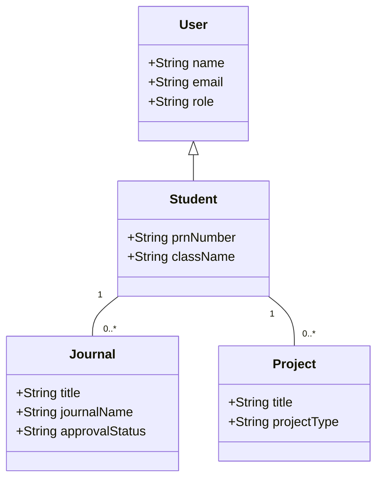
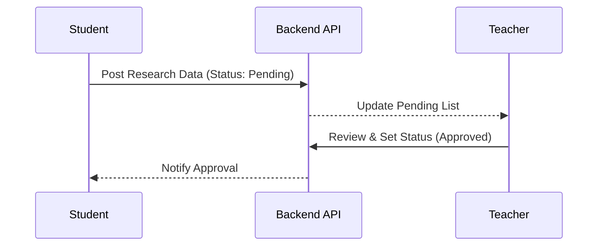

# DeptSync: Department Data Management & Research Tracking
## Comprehensive Project Documentation (SDLC, SRS, Design & Testing)

---

## 1. Introduction

### 1.1 Brief Description
**DeptSync** is a centralized Department Data Management system designed for academic institutions. It digitizes the tracking of research contributions (Journals, Patents, Grants) and academic milestones (Projects, Achievements). The system synchronizes data between Students, Faculty (Teachers), and Department Administrators to create a single source of truth for academic performance.

### 1.2 Problem Statement
Most academic departments rely on manual entry, spreadsheets, or fragmented Google Forms to track research papers and student projects. This leads to:
*   **Data Inconsistency**: Multiple versions of the same research record.
*   **Approval Delays**: Lack of a streamlined workflow for faculty to review submissions.
*   **Reporting Burden**: Manual effort required to generate department-wide analytics for accreditation (NAAC, NIRF).

### 1.3 Objectives
*   To automate the submission and approval lifecycle of research data.
*   To provide real-time dashboards for all user roles.
*   To ensure data integrity through standardized schema and validation.
*   To facilitate easy generation of contribution reports for administrators.

### 1.4 Scope and Limitations
**Scope:** Covers all major research modules (Journals, Conferences, Patents, Copyrights, Grants, Consultancies) and student projects.
**Limitations:** Initial version focuses on data tracking and internal approvals; it does not include external plagiarism checking or direct integration with publication databases (like Scopus API) in the core MVP.

---

## 2. SDLC Model Selection & Rationale

### 2.1 Chosen SDLC Model: Agile (Scrum)
DeptSync utilizes the **Agile Scrum** framework.

### 2.2 Justification
#### 2.2.1 Requirement Flexibility
As the system is used by different departments, specific requirements for research fields often change. Agile allows us to refine our Mongoose schemas iteratively.
#### 2.2.2 Speed to Market (MVP Approach)
We prioritized the "Journal Publication" and "Project" modules as the MVP to provide immediate value while other modules (Patents, Grants) were developed in subsequent sprints.
#### 2.2.3 User-Centric Feedback Loop
Continuous testing by students and faculty during development ensured the UI/UX was intuitive for users with varying technical expertise.
#### 2.2.4 Risk Management
By delivering features in 2-week increments, we identified database matching issues (like the `studentId` vs `createdById` inconsistency) early in the development cycle.

---

## 3. Requirement Analysis (SRS)

### 3.1 Functional Requirements

#### Module 1: User Authentication & Profile
*   **FR1.1**: Role-based access control (RBAC) for Admin, Teacher, and Student.
*   **FR1.2**: Department-specific registration and classroom joining logic.

#### Module 2: Research Management (Contribution Side)
*   **FR2.1**: Students can upload details for Journals, Patents, and Copyrights.
*   **FR2.2**: Support for multiple indexing types (Scopus, IEEE, UGC Care).
*   **FR2.3**: Uploading of supporting documents/proofs for each contribution.

#### Module 3: Academic Management (Project Side)
*   **FR3.1**: Major/Mini/Research project tracking.
*   **FR3.2**: Group project support with member identification.

#### Module 4: Approval Workflow (The "Sync" Logic)
*   **FR4.1**: Teachers view pending submissions from their assigned department/classroom.
*   **FR4.2**: Decision-making interface (Approve/Reject) with comment fields.
*   **FR4.3**: Real-time status updates on student dashboards.

#### Module 5: Admin Panel & Analytics
*   **FR5.1**: Global view of all approved research for department reporting.
*   **FR5.2**: User management and department configuration.

### 3.2 Non-functional Requirements
*   **3.2.1 Security**: JWT-based session management and password hashing (Bcrypt).
*   **3.2.2 Performance**: Optimized MongoDB queries using indexing for faster dashboard loading.
*   **3.2.3 Usability**: Modern, responsive UI built with Tailwind CSS for mobile and desktop use.
*   **3.2.4 Reliability**: Mongoose middleware for data validation to prevent partial record saving.

---

## 4. System Design (UML)

### 4.1 Use Case Diagram
```mermaid
useCaseDiagram
    actor "Student" as S
    actor "Teacher" as T
    actor "Admin" as A

    S --> (Submit Journal/Patent)
    S --> (Join Classroom)
    S --> (View Approval Status)

    T --> (Review Submissions)
    T --> (Approve/Reject Research)
    T --> (Manage Classroom)

    A --> (View Dept Analytics)
    A --> (Manage Users)
```

### 4.2 Class Diagram


### 4.3 Sequence Diagram (Approval Flow)


---

## 5. GUI Design

### 5.1 Login Page: Minimalist interface with role selection.
### 5.2 Research Submission: Multi-step forms for complex data like Patents.
### 5.3 Student Dashboard: Card-based statistics showing counts of approved vs pending items.
### 5.4 Teacher Review: Detailed modal views for comparing student data with uploaded proofs.

---

## 6. Software Quality Assurance Plan

*   **Testing Strategy**: Unit testing for backend controllers and Integration testing for the end-to-end submission flow.
*   **Tools**: Postman for API testing, Jest for logic validation.
*   **Metrics**: Code coverage target of 85% for core business logic.

---

## 7. Integration of Modern SE Trends

*   **Cloud Computing**: Hosted on modern cloud platforms (Render/AWS) with MongoDB Atlas.
*   **DevOps**: CI/CD pipelines via GitHub Actions for automated deployment.
*   **AI/ML**: Potential integration for auto-extracting metadata from research paper PDFs.
*   **PWA**: Frontend optimized for offline-first viewing of student profiles.

---

## 8. Conclusion and Future Scope

DeptSync successfully digitizes the academic contribution lifecycle. Future updates will include automated report generation for NIRF/NAAC and direct API integrations with Scopus for automated publication verification.
